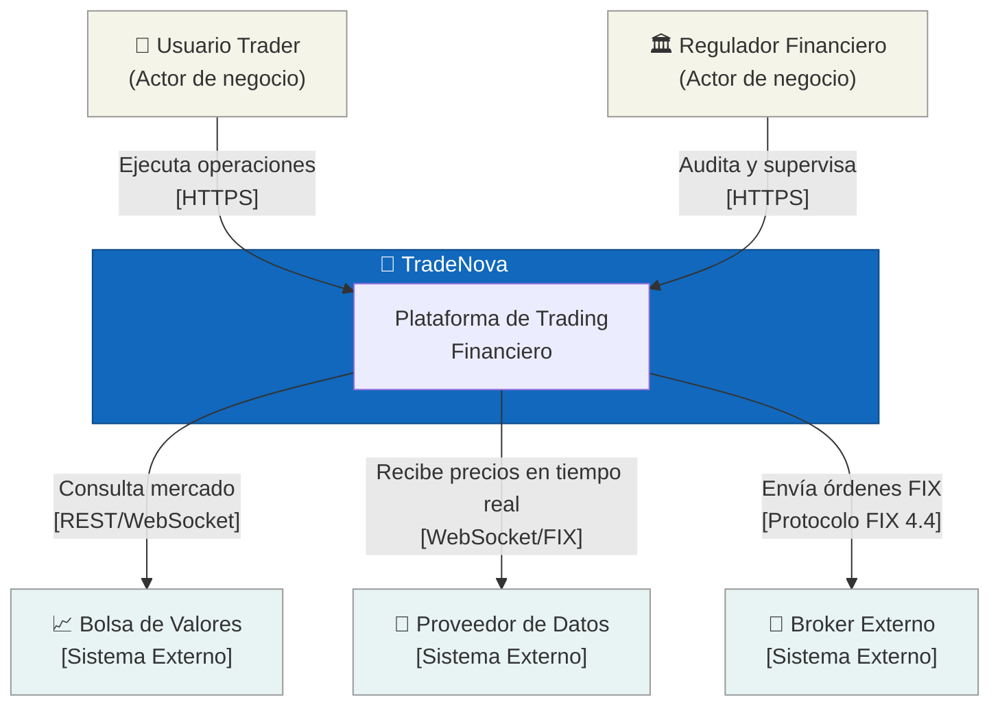
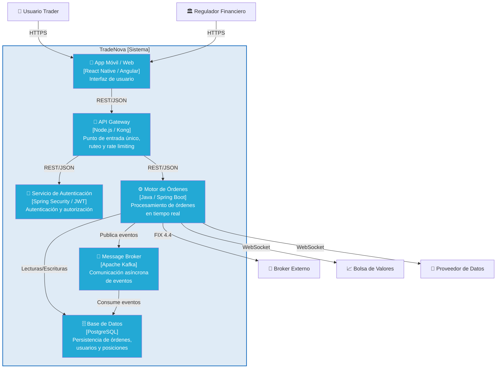
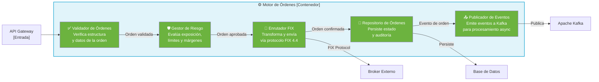
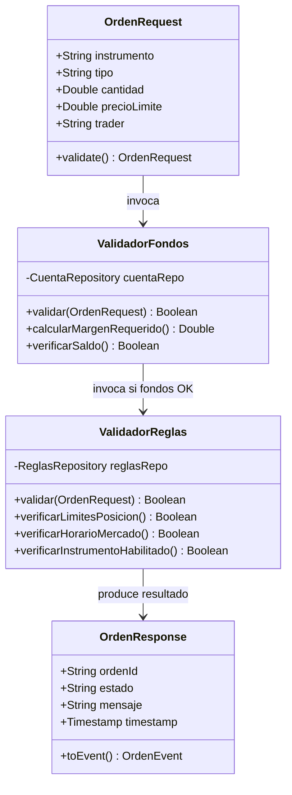

# TradeNova — Arquitectura C4

> **Laboratorio No. 2 · Diseño Arquitectónico de Software**  
> Maestría en Arquitectura de Software

---

## Descripción del Sistema

**TradeNova** es una plataforma de trading financiero diseñada para la ejecución de operaciones bursátiles en tiempo real. El sistema permite a traders profesionales gestionar órdenes de compra/venta con integración directa a brokers externos vía protocolo **FIX**, procesamiento de eventos asíncrono con **Apache Kafka**, y datos de mercado en vivo.

La arquitectura fue modelada con el framework **C4 Model** (Simon Brown), usando **ArchiMate** como lenguaje de modelado, lo que garantiza trazabilidad y claridad en cada nivel de abstracción: desde la vista de negocio hasta el detalle del código.

---

## El Modelo C4

El modelo C4 describe la arquitectura de software mediante **4 niveles de zoom**, cada uno orientado a una audiencia distinta:

| Nivel | Diagrama | Audiencia | Pregunta que responde |
|-------|----------|-----------|----------------------|
| 1 | Contexto | Todos (técnicos y no técnicos) | ¿Qué hace el sistema y con quién interactúa? |
| 2 | Contenedores | Arquitectos y DevOps | ¿Cuáles son las aplicaciones y servicios internos? |
| 3 | Componentes | Desarrolladores | ¿Cómo está estructurado cada contenedor? |
| 4 | Código | Desarrolladores | ¿Cómo se implementa cada componente? |

---

## Nivel 1 — Diagrama de Contexto

Muestra TradeNova como una caja negra, sus usuarios y los sistemas externos con los que se integra.



### Actores y Sistemas Externos

| Elemento | Tipo | Descripción |
|----------|------|-------------|
| **Usuario Trader** | Actor | Profesional financiero que ejecuta operaciones de compra/venta |
| **Regulador Financiero** | Actor | Entidad reguladora que audita y supervisa las operaciones del sistema |
| **Bolsa de Valores** | Sistema Externo | Fuente de datos de mercado; recibe consultas de precios y disponibilidad |
| **Proveedor de Datos** | Sistema Externo | Suministra feeds de precios en tiempo real vía WebSocket/FIX |
| **Broker Externo** | Sistema Externo | Ejecuta las órdenes en el mercado real usando protocolo FIX 4.4 |

---

## Nivel 2 — Diagrama de Contenedores

Descompone TradeNova en sus contenedores: aplicaciones ejecutables, almacenes de datos y servicios internos.



### Descripción de Contenedores

| Contenedor | Tecnología sugerida | Responsabilidad |
|------------|-------------------|-----------------|
| **App Móvil / Web** | React Native · Angular | Dashboard de trading, visualización de portafolio, ingreso de órdenes |
| **API Gateway** | Kong · AWS API Gateway | Punto de entrada único, autenticación de tokens, rate limiting, logging |
| **Servicio de Autenticación** | Spring Security · OAuth2/JWT | Login, gestión de sesiones, roles y permisos de usuarios |
| **Motor de Órdenes** | Java · Spring Boot | Core del sistema: validación, gestión de riesgo, enrutamiento de órdenes |
| **Message Broker (Kafka)** | Apache Kafka | Bus de eventos asíncrono para desacoplar el procesamiento de órdenes |
| **Base de Datos** | PostgreSQL | Persistencia de órdenes, posiciones, historial de transacciones |

---

## Nivel 3 — Diagrama de Componentes

Descompone el **Motor de Órdenes** en sus componentes internos y sus responsabilidades.



### Descripción de Componentes — Motor de Órdenes

| Componente | Responsabilidad | Patrón |
|------------|-----------------|--------|
| **Validador de Órdenes** | Verifica formato, campos requeridos, tipo de instrumento y cantidad | Chain of Responsibility |
| **Gestor de Riesgo** | Calcula exposición, verifica límites de pérdida y margen disponible | Strategy Pattern |
| **Enrutador FIX** | Transforma la orden al protocolo FIX 4.4 y la envía al broker | Adapter Pattern |
| **Repositorio de Órdenes** | Persiste el estado completo de cada orden y su ciclo de vida | Repository Pattern |
| **Publicador de Eventos** | Emite eventos de dominio (`OrdenCreada`, `OrdenEjecutada`) a Kafka | Observer / Event Publisher |

---

## Nivel 4 — Diagrama de Código

Detalla la implementación interna del componente **Validador de Órdenes** a nivel de clases.



### Flujo de Validación

```
OrdenRequest ──▶ ValidadorFondos ──▶ ValidadorReglas ──▶ OrdenResponse
     │                  │                    │                  │
  Datos de         Verifica saldo       Verifica reglas    APROBADA /
  la orden         y margen            de negocio          RECHAZADA
```

| Clase | Tipo | Responsabilidad |
|-------|------|-----------------|
| **OrdenRequest** | DTO de entrada | Encapsula todos los datos de la orden enviada por el trader |
| **ValidadorFondos** | Servicio de dominio | Verifica que el trader tenga fondos y margen suficiente |
| **ValidadorReglas** | Servicio de dominio | Aplica reglas de negocio: horarios, límites de posición, instrumentos |
| **OrdenResponse** | DTO de salida | Resultado final con estado (`APROBADA`/`RECHAZADA`), ID y timestamp |

---

## Decisiones Arquitectónicas Clave

### Event-Driven Architecture con Kafka
El Motor de Órdenes publica eventos de dominio (`OrdenCreada`, `OrdenEjecutada`, `OrdenRechazada`) en Kafka. Esto permite:
- **Desacoplamiento** entre el procesamiento síncrono y la persistencia
- **Escalabilidad horizontal** de consumidores independientes
- **Auditoría completa** de cada transición de estado de una orden

### Protocolo FIX 4.4
La integración con brokers externos usa el estándar de la industria **Financial Information eXchange (FIX)**. El Enrutador FIX actúa como Adapter, traduciendo el modelo interno de órdenes al formato FIX.

### API Gateway como punto único de entrada
Centraliza cross-cutting concerns: autenticación JWT, rate limiting, logging y circuit breaker, evitando duplicarlos en cada servicio interno.

---

## Estructura del Repositorio

```
TradeNova-Arquitectura-C4/
│
├── README.md                                          # Este archivo
├── TradeNova_C4.archimate                             # Modelo ArchiMate (fuente)
├── TradeNova_C4.archimate.bak                         # Backup del modelo
│
└── Desarrollo_U3_DisenoArqSoft_Final_Alejandro_De_Mendoza.docx   # Informe final
    Desarrollo_U3_DisenoArqSoft_Final_Alejandro_De_Mendoza.pdf    # Informe final (PDF)
```

> **Nota:** Los diagramas exportados (.png), los informes complementarios y los archivos de actividades formativas se excluyen del repositorio vía `.gitignore` para mantener limpio el historial de versiones. El modelo fuente `.archimate` permite regenerarlos en cualquier momento con la herramienta [Archi](https://www.archimatetool.com/).

---

## Herramientas Utilizadas

| Herramienta | Propósito |
|-------------|-----------|
| **[Archi](https://www.archimatetool.com/)** | Modelado ArchiMate y generación de diagramas C4 |
| **ArchiMate 3.1** | Lenguaje de modelado de arquitectura empresarial |
| **C4 Model** | Framework de comunicación de arquitectura de software |
| **Protocolo FIX 4.4** | Estándar de mensajería financiera para ejecución de órdenes |
| **Apache Kafka** | Plataforma de streaming de eventos distribuida |

---

## Autor

**Alejandro De Mendoza**  
Maestría en Arquitectura de Software  
Materia: Diseño Arquitectónico de Software — Laboratorio No. 2

---

*Modelado con el framework C4 (Simon Brown) — [c4model.com](https://c4model.com)*
